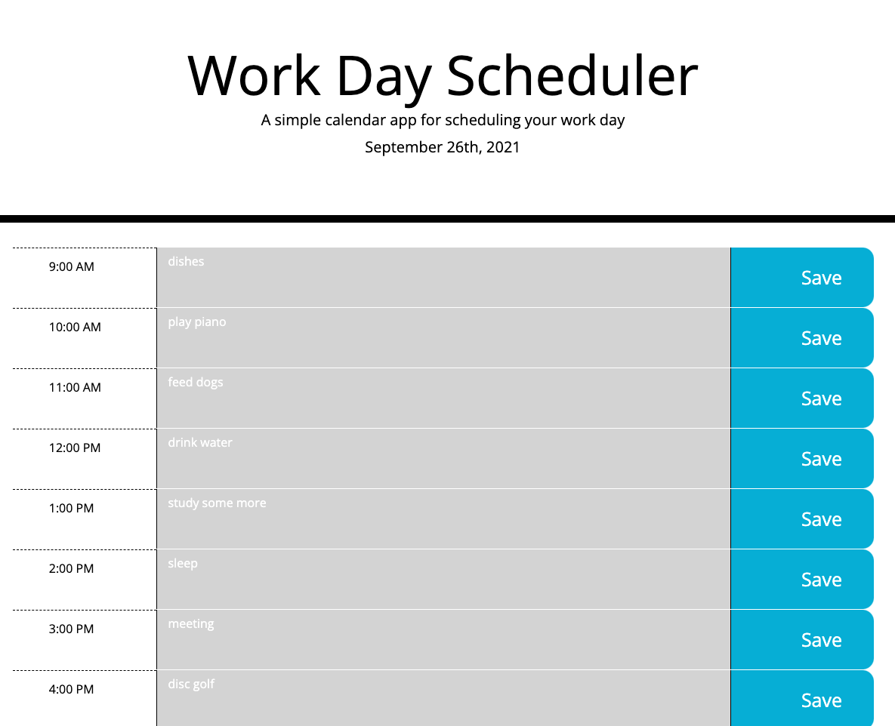
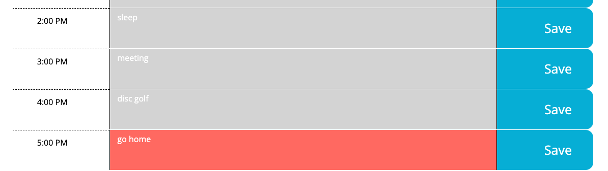

# SUPER-DISCO
=========================================================================

## TABLE OF CONTENTS
--------------------

* Introduction
* Technologies used
* Updates
* Maintainers

## INTRODUCTION
--------------

**Super-Disco is a workday calendar app with the ability to add and save events:**
1. Click a time block and input the description of a event
2. Click save
3. Click original event to change to something new
3. Add additional events in additional time blocks, if desired
4. Reload page, and events will remain visible

**View the homepage, here:** [Super-Disco](https://grohtech.github.io/super-disco/ "Super-Disco App")

**View website screenshots, here:**  
  
 

## TECHNOLOGIES USED
--------------------

* HTML
* CSS
* JavaScript
* jQuery
* moment.js
* Bootstrap

## UPDATES
----------

* **09.26.21 - Launch Date**
    * Added current date display using moment.JS
    * Created Bootstrap grid 
    * Color-coded past, present, future time blocks
    * Added ability to save events to localStorage
    * Added ability to refresh screen, while keeping events visible on calendar

## MAINTAINERS
--------------

**Current maintainers**
1. Lauren Groh - [GitHub](https://github.com/GrohTech "GitHub Profile")